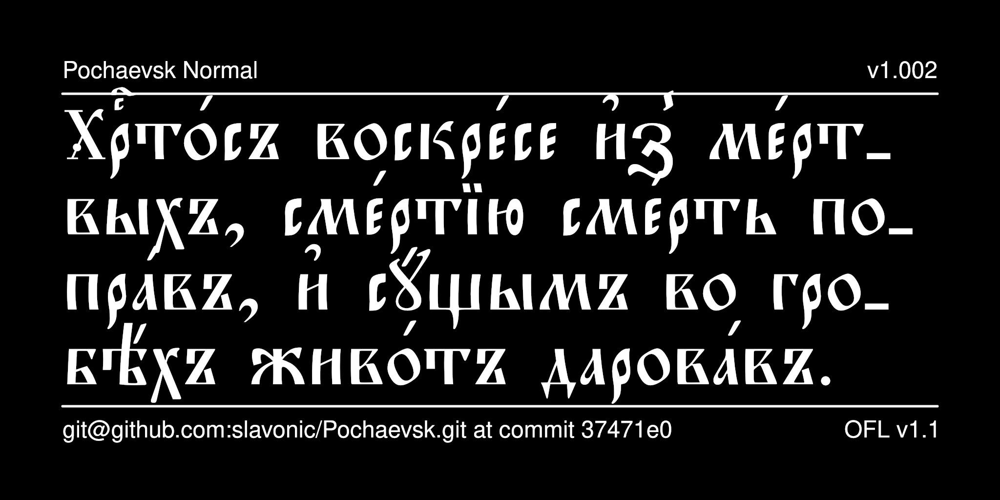

# Pochaevsk Typeface

Pochaevsk is a contemporary Church Slavonic font that reproduces the typeface used in editions published by the Holy Dormition Pochaiv Lavra in the late 19th century and, subsequently, in editions published in the 20th century by Holy Trinity Monastery in Jordanville, New York.

Due to its small vertical metrics, this font is convenient
for use in bilingual editions featuring Church Slavonic text
and text in another language.



## History

Pochaevsk originally existed in a variety of ad hoc codepages with
variants attributed to different designers: Orthodox Information Data
Associates (year unknown); Starina Russian Antiquities, developed by 
Nikita Simmons (1996); Archbishop John (1999). Reencoded for the 
[Irmologion project](http://irmologion.ru/fonts.html#pochaevsk) by
Vlad Dorosh as Pochaevsk Ucs (version 2.1, 2003).
Reencoded for Unicode by Aleksandr Andreev as part of the
[Slavonic Computing Initiative](https://sci.ponomar.net/fonts.html)
and edited, released under SIL OFL v. 1.1.
Edited by Aleksandr Andreev for Google Fonts.

## License

This Font Software is licensed under the SIL Open Font License,
Version 1.1. This license is available with a FAQ at
[https://openfontlicense.org/](https://openfontlicense.org/).

## Building the Fonts

The font source is stored in a FontForge SFD file in the `sources/` directory. All modifications should be made in FontForge, resulting in an updated SFD file. This file is then converted to UFO format by running the convert script. From terminal:

```
cd your/local/project/directory
./convert.sh
```

The font can then be built using fontmake and gftools by running:

```
make build
```

Note that this requires Python and will install all of the necessary libraries and tools into a virtualenv at `venv/`.

To delete the virtualenv and the results of the build, run:

```
make clean
```

To build the sample image the sits at the top of this README, run:

```
make images
```

The commands `make update` and `make update-project-template` update the repository structure and Python dependencies and should be run periodically.

Google's master repository also had a GitHub workflow for building the fonts in the cloud on push, but this seems to always fail because of incorrect dependencies, so has been disabled. Instead, built binaries are stored on GitHub in the `fonts/` directory.

This font has been added to [Google Fonts](https://fonts.google.com/specimen/Pochaevsk) and is available for use in Google Docs and other cloud-based software.

## Features

* Stylistic Set 1 (*ss01*) changes the hyphen symbol (-) to an 
underscore (_), which is the default hyphenation symbol used
in Synodal Church Slavonic. This can be used for software such
as LibreOffice that does not support changing the default
hyphenation character.

* Stylistic Alternatives (*salt*) are provided for the following
characters:
  - a short version of lowercase yat (U+0463)
  - an alternative form of capital omega (U+0460)
  - tiny, short, and long forms of the combining titlo (U+0483)
  - five alternative forms of the Symbol for Mark's Chapter (U+1F545)

See your software's documentation about how to access these glyphs.

## More Church Slavonic Fonts

See the [main repository](https://github.com/typiconman/fonts-cu/issues) and the [website](https://sci.ponomar.net/fonts.html).